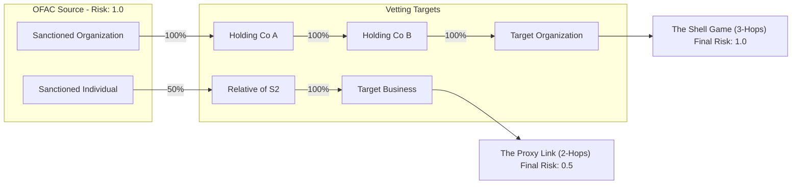

# Demonstration Walkthrough: Transitive Risk Analysis

This guide provides a step-by-step walkthrough for demonstrating how the Sentries platform identifies hidden risk in complex networks using multi-hop propagation.

## 1. Visualizing Multi-Hop Risk Propagation

Before diving into the UI, it is important to understand the logic of the propagation engine. In a traditional database, finding these links requires complex joins. In Sentries, we traverse the graph to calculate risk by association.

### Risk Propagation Logic
- **Ownership (`owned_by`)**: 100% risk inheritance.
- **Leadership (`leader_of`)**: 80% risk inheritance.
- **Family (`family_member_of`)**: 50% risk inheritance.



---

## 2. Computing Transitive Risk with AQL

The Sentries platform uses ArangoDB's native AQL (ArangoDB Query Language) to compute transitive risk through graph traversals. This section explains how the AQL engine calculates risk propagation.

### AQL Graph Traversal Query

The core AQL query performs a multi-hop graph traversal to discover all paths connecting a target entity to sanctioned sources:

```aql
FOR v, e, p IN 1..3 ANY @entityID owned_by, leader_of, family_member_of
    // Validate path direction for risk flow
    FILTER (IS_SAME_COLLECTION('owned_by', e) ? e._from == @entityID : true)
    FILTER (IS_SAME_COLLECTION('leader_of', e) ? e._to == @entityID : true)
    
    // Compute path multiplier from edge weights
    LET pathMultiplier = PRODUCT(p.edges[*].propagationWeight)
    
    // Aggregate risk from sanctioned targets
    COLLECT entity = @entityID AGGREGATE 
        inheritedRisk = SUM(pathMultiplier * (v.riskScore || 0))
    
    LET baseScore = DOCUMENT(@entityID).riskScore || 0
    RETURN {
        label: DOCUMENT(@entityID).label,
        directRisk: baseScore,
        inferredRisk: inheritedRisk,
        totalExposure: baseScore + inheritedRisk
    }
```

### How It Works

1. **Graph Traversal**: `FOR v, e, p IN 1..3 ANY @entityID owned_by, leader_of, family_member_of`
   - Traverses 1 to 3 hops from the target entity
   - Follows `owned_by`, `leader_of`, and `family_member_of` edges in any direction
   - Returns vertices (`v`), edges (`e`), and paths (`p`)

2. **Directional Filtering**: 
   - For `owned_by`: Ensures traversal follows ownership chains (child → parent)
   - For `leader_of`: Ensures traversal follows leadership chains (organization → leader)
   - For `family_member_of`: Allows traversal in both directions (symmetric relationship)

3. **Path Multiplier Calculation**: `PRODUCT(p.edges[*].propagationWeight)`
   - Multiplies the propagation weights along each path
   - Example: A 3-hop path with weights [1.0, 1.0, 0.5] = 0.5 total multiplier

4. **Risk Aggregation**: `SUM(pathMultiplier * (v.riskScore || 0))`
   - For each sanctioned entity found, multiplies its risk score by the path multiplier
   - Sums all inherited risk from all discovered paths
   - Handles multiple paths to the same sanctioned entity

### Example Calculation

For "The Shell Game" scenario (3-hop ownership chain):

```
Path: Sanctioned Org (risk: 1.0) 
  → [owned_by, weight: 1.0] 
  → Holding Layer 1 
  → [owned_by, weight: 1.0] 
  → Holding Layer 2 
  → [owned_by, weight: 1.0] 
  → Target Org

Path Multiplier: 1.0 × 1.0 × 1.0 = 1.0
Inherited Risk: 1.0 × 1.0 = 1.0
Final Risk: 0.0 (direct) + 1.0 (inherited) = 1.0
```

For "The Proxy Link" scenario (family + ownership):

```
Path: Sanctioned Individual (risk: 1.0)
  → [family_member_of, weight: 0.5]
  → Relative
  → [owned_by, weight: 1.0]
  → Target Business

Path Multiplier: 0.5 × 1.0 = 0.5
Inherited Risk: 1.0 × 0.5 = 0.5
Final Risk: 0.0 (direct) + 0.5 (inherited) = 0.5
```

### Running the Query

You can execute this query in the ArangoDB Query Editor:

1. Navigate to **Queries** → **Saved Queries** in the ArangoDB UI
2. Select **"Sentries - Dynamic Risk Vetting"**
3. Bind `@entityID` to any entity's `_id` (e.g., `"Organization/12345"`)
4. Execute to see real-time risk calculation for that entity

---

## 3. Walkthrough Steps

### Step 1: Initialize the Environment
Ensure the latest scenarios are loaded into the database.
```bash
python3 scripts/generate_test_data.py
python3 scripts/calculate_inferred_risk.py
```

### Step 2: Open the Visualizer
1. Navigate to the ArangoDB UI -> **Graphs** -> **KnowledgeGraph**.
2. Select the **sentries_standard** theme (or **Ontology** if exploring the schema).
3. Switch to the **sentries_risk_heatmap** theme to see risk coloring.

### Step 3: Reveal "The Shell Game" (3-Hop Detection)
1. **Search**: In the search bar, type `Vetting Target - 3-Hop Link`.
2. **Inspect**: Note that the node is **Red** (High Risk) and has an `inferredRisk` of **1.0**, despite having a `riskScore` of **0.0**.
3. **Trace**: Right-click the node and select **Canvas Action** -> **[Organization] Expand Relationships**.
4. **Follow the Path**: 
   - Expand the resulting `Holding - Layer 2`.
   - Expand `Holding - Layer 1`.
   - Reveal the original **Sanctioned Organization**.
5. **Conclusion**: Demonstrate that the system flagged a seemingly clean company buried under three layers of ownership.

### Step 4: Reveal "The Proxy Link" (Family Ties)
1. **Search**: Type `Vetting Target - Family Link`.
2. **Inspect**: Note the node is **Yellow** (Medium Risk) with a score of **0.5**.
3. **Trace**: Expand relationships to find the `Relative`.
4. **Reveal Source**: Expand the relative to find the **Sanctioned Individual**.
5. **Conclusion**: Show how "Risk by Association" via non-corporate ties (Family) is automatically captured and weighted differently.

---

## 4. Key Takeaways for Presentation
- **Depth**: We go beyond simple lists to find risk 3+ hops away.
- **Automation**: Inferred risk is calculated across the entire graph in seconds.
- **Visual Evidence**: The "dashed" lines in the UI immediately signal that these are investigated associations rather than official list entries.
